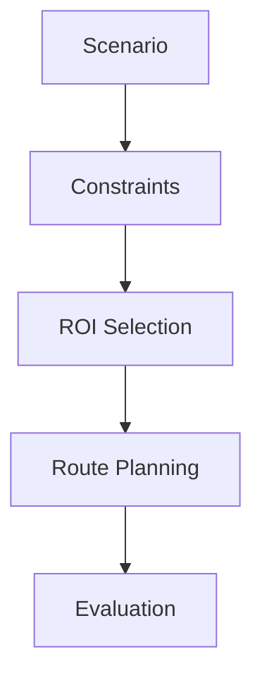

# ROI-Selection-for-Route-Planning

## Thesis: Adaptive Region of Interest Selection Under Dynamic Constraints for Efficient Route Planning

### Abstract:

This thesis presents a constraint-aware region of interest (ROI) selection method to improve 
the efficiency and reliability of route planning. The approach incorporates dynamic environmental
factors, using weather conditions as a representative example to demonstrate its extensibility
to additional constraints. Unlike traditional methods that rely on fixed ROIs, the proposed
approach dynamically adapts the search region based on real-time data. This enables the system
to prioritize relevant areas while avoiding constraint-violating regions. The work focuses 
on the design of adaptive ROI heuristics and their evaluation across diverse scenarios. A full 
implementation of the method is provided. Its effectiveness is demonstrated through simulation 
and performance analysis.


## Project Structure
```
ROI-Selection-for-Route-Planning
│
├── README.md
├── requirements.txt
├── pyproject.toml
├── main.py
│
├── core/
│   ├── __init__.py
│   │
│   ├── base/
│   │   ├── __init__.py
│   │   ├── roi_selector.py
│   │   ├── constraint.py
│   │   ├── planner.py
│   │   └── scenario.py
│   │
│   ├── roi/
│   │   ├── __init__.py
│   │   ├── dynamic_roi.py
│   │   ├── static_roi.py
│   │   └── heuristic_roi.py
│   │
│   ├── constraints/
│   │   ├── __init__.py
│   │   ├── weather_constraint.py
│   │   ├── traffic_constraint.py
│   │   └── energy_constraint.py
│   │
│   ├── planning/
│   │   ├── __init__.py
│   │   ├── astar.py
│   │   ├── dijkstra.py
│   │   └── route_manager.py
│   │
│   └── simulation/
│       ├── __init__.py
│       ├── simulator.py
│       ├── evaluator.py
│       └── metrics.py
│
├── utils/
│   ├── __init__.py
│   ├── logger.py
│   ├── config.py
│   ├── dates.py
│   ├── geometry.py
│   ├── graph_utils.py
│   └── visualization.py
│
├── data/
│   ├── maps/
│   ├── weather/
│   └── scenarios/
│
├── experiments/
│   ├── benchmark_01.py
│   ├── benchmark_02.py
│   └── compare_roi_methods.py
│
├── tests/
│   ├── __init__.py
│   │
│   ├── conftest.py
│   ├── test_constraints.py
│   ├── test_roi.py
│   ├── test_planner.py
│   └── test_simulation.py
│
└── docs/
    └── architecture.md
```

## Implementation order

1. Base classes
2. Graph representation
3. Simple static ROI
4. Dynamic ROI
5. Weather constraint
6. Route planner integration
7. Evaluation metrics
8. Benchmark scenarios


Pipeline:
